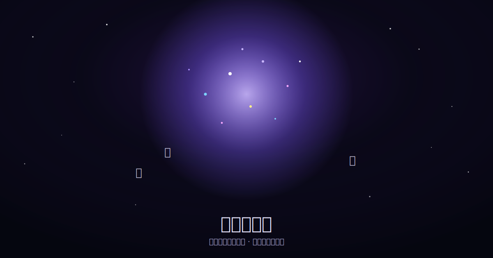

# 🚀 废话转换器 Complaint Launcher

把一句抱怨或吐槽输入进去，点击「发射」，文字会化成星星飞向天空，最终汇聚成一片会缓慢旋转、闪烁的星云。



## 玩法

1. 在底部输入框写一句抱怨（比如"又堵车了！"）
2. 点击「🚀 发射」或按 Enter
3. 每个字都会变成一颗星，沿弧线飞向天空，落地后加入你的专属星云
4. 发射得越多，星云越大

## 技术栈

纯前端，零依赖：

- HTML5 Canvas 做粒子动画
- 原生 JavaScript（贝塞尔曲线轨迹 + requestAnimationFrame）
- 纯 CSS 做 UI（玻璃拟态面板）

## 本地运行

直接双击 `index.html` 用浏览器打开即可，不需要安装任何依赖或起服务。

如果浏览器对本地文件有限制，也可以起个简单的静态服务器：

```bash
python3 -m http.server 8000
# 然后访问 http://localhost:8000
```

## 项目结构

```
complaint-launcher/
├── index.html      页面结构
├── style.css       样式
├── script.js       动画与交互逻辑
└── docs/
    └── preview.svg  预览图
```

## 以后可以加

- [ ] 发射音效 / 星云背景音乐
- [x] 把星云状态存到 localStorage，刷新不丢失
- [ ] 分享星云截图
- [ ] 深色/浅色主题切换

## License

[MIT](LICENSE)
